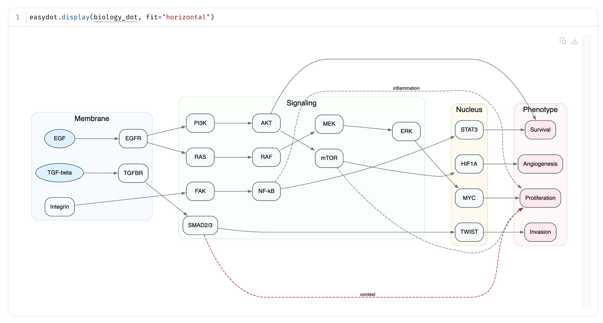

<div align="center">


**High-quality Graphviz plots from Python, with browser, WASM, and native backends.**

[](https://pypi.org/project/easydot/)
[](LICENSE)
[](https://marimo.app/l/939bsu)
[](https://molab.marimo.io/notebooks/nb_mqYSyytiDeXt2eKhJyEkcE)

</div>

```bash
pip install easydot
```

```python
import easydot

easydot.render("digraph { A -> B -> C }")
```

## Example



---

## 💡 Why easydot

Graphviz is the best way to lay out DOT graphs, but the right runtime depends
on where your code is running. Native `dot` is great when it is installed;
browser rendering is better in notebooks and sandboxed frontends; server-side
WASM is useful when you want static SVGs without system binaries.

`easydot` gives all three paths a small Python API.

- **One entry point.** `easydot.render(...)` returns a rich notebook display object; `easydot.to_string(...)` returns raw HTML or SVG.
- **Three backends.** `browser` uses JS/WASM in the frontend, `wasm` uses `wasi-graphviz` in Python, and `native` shells to installed Graphviz executables.
- **Pip-installable default.** The browser backend has no Python dependencies and does not require `brew`, `conda`, `apt-get`, or Dockerfile changes.
- **Tiny notebook outputs.** The WASM bundle is vendored and served once over loopback instead of inlined into every cell.
- **Offline-capable.** Browser assets ship in the package; server-side backends do not need browser network access.

## 🔤 Why DOT

DOT is a small text format for graph diagrams. Many Python libraries and build tools can generate it.

- **Common output format.** [NetworkX](https://networkx.org/), [pydot](https://pypi.org/project/pydot/), [pygraphviz](https://pygraphviz.github.io/), [scikit-learn](https://scikit-learn.org) decision trees, [PyTorch](https://pytorch.org) and [TensorFlow](https://www.tensorflow.org) model viz, [Dask](https://www.dask.org/) task graphs, [Airflow](https://airflow.apache.org/) DAGs, Terraform, Bazel, Ninja, `gprof2dot`, and other tools can emit DOT.
- **LLM-friendly.** Models can usually generate DOT for architecture diagrams, state machines, and dependency graphs.
- **Plain text.** Diffs cleanly, templates easily, pipes nicely.
- **Graphviz features.** Five layout engines (`dot`, `neato`, `fdp`, `circo`, `twopi`), clusters, HTML-like labels, and styling.

## 🚀 Usage

### Quick start

`render()` is the main interface. It returns a `Graph` object that displays
in Jupyter, marimo, and other rich-output environments. Use `backend="auto"`
(the default) to select the first working backend, or pick one explicitly.

```python
import easydot

# Auto-select the best available backend (native → wasm → browser)
easydot.render("digraph { A -> B -> C }")

# Explicit backends
easydot.render("digraph { A -> B -> C }", backend="browser")   # browser JS/WASM
easydot.render("digraph { A -> B -> C }", backend="wasm")      # server-side WASM
easydot.render("digraph { A -> B -> C }", backend="native")    # native Graphviz

# Fit and scale work on all backends
easydot.render("digraph { A -> B -> C }", fit="horizontal")
easydot.render("digraph { A -> B -> C }", fit="both", scale=1.5)

# Raw output
easydot.svg("digraph { A -> B -> C }")                       # SVG string (wasm/native)
easydot.html("digraph { A -> B -> C }", fit="horizontal")    # display-ready HTML
easydot.native("digraph { A -> B -> C }", format="png")      # PNG bytes
```

### Backend guide

| Backend   | Runtime             | Fit/scale | Best for                                      |
| --------- | ------------------- | --------- | --------------------------------------------- |
| `browser` | frontend JS/WASM    | ✓         | notebooks, marimo, JupyterLite, Pyodide       |
| `wasm`    | Python WASI runtime | ✓         | saved notebooks, GitHub, CI without Graphviz  |
| `native`  | Graphviz executable | ✓         | local/conda/server environments with Graphviz |

Check what works in the current runtime:

```python
caps = easydot.capabilities()
caps["browser"].available   # True if local or CDN browser assets are reachable
caps["wasm"].available      # True if wasi-graphviz can render a probe graph
caps["native"].available    # True if native dot can render a probe graph
```

`backend="auto"` uses these probes and chooses `native`, then `wasm`, then
`browser` with CDN assets, then `browser` with local assets.
Probe results are cached in-process; pass `refresh_capabilities=True` to
`render(..., backend="auto")` or `refresh=True` to `capabilities()` if the
runtime changes after startup.

### Server-side WASM

For static SVG output that works in saved notebooks and GitHub without a live browser runtime:

```bash
pip install easydot[wasm]
```

```python
import easydot

# Raw SVG string
svg = easydot.svg("digraph { A -> B -> C }", backend="wasm")

# Rich display object for notebooks — fit and scale work the same as browser
easydot.render("digraph { A -> B -> C }", backend="wasm", fit="horizontal")

# Display-ready HTML with fit/scale
html = easydot.html("digraph { A -> B -> C }", backend="wasm", fit="both")
```

### Native Graphviz

If Graphviz executables are installed and available on `PATH`, `easydot` can
render through the native toolchain:

```python
import easydot

svg = easydot.svg("digraph { A -> B -> C }", backend="native")
easydot.render("digraph { A -> B -> C }", backend="native", fit="horizontal")

# Non-SVG formats: native() returns bytes for binary formats
png_bytes = easydot.native("digraph { A -> B -> C }", format="png")
pdf_bytes = easydot.native("digraph { A -> B -> C }", format="pdf")
```

The native backend shells to the selected Graphviz engine, such as `dot` or
`neato`, and fails if the executable is missing or Graphviz returns an error.

### pydot

```bash
pip install easydot[pydot]
```

```python
import easydot, pydot

graph = pydot.Dot("example", graph_type="digraph")
graph.add_edge(pydot.Edge("A", "B"))

easydot.render(graph)
```

### NetworkX

```python
import easydot, networkx as nx
from networkx.drawing.nx_pydot import to_pydot

G = nx.DiGraph([("A", "B"), ("B", "C"), ("A", "C")])
easydot.render(to_pydot(G))
```

### CLI

```bash
# HTML output (default) — fit and scale work on all backends
echo 'digraph { A -> B }' | easydot                              # browser backend HTML
echo 'digraph { A -> B }' | easydot --backend auto              # best available backend
echo 'digraph { A -> B }' | easydot --backend wasm --fit horizontal   # WASM with fit
echo 'digraph { A -> B }' | easydot --backend native --scale 1.5      # native with scale

# Raw SVG (wasm or native only)
echo 'digraph { A -> B }' | easydot --format svg --backend wasm
echo 'digraph { A -> B }' | easydot --format svg --backend native

# Binary formats (native only)
echo 'digraph { A -> B }' | easydot --format png --backend native > graph.png
echo 'digraph { A -> B }' | easydot --format pdf --backend native > graph.pdf

easydot --urls                                                    # print asset server URLs
```

## 🔀 Source Modes

By default, `easydot` tries a pinned CDN URL first and falls back to the local server.
Known hosted notebook environments skip the local server probe, because a
Python-side `127.0.0.1` server is not browser-reachable there.

| Mode    | Local | CDN | Best for                                               |
| ------- | :---: | :-: | ------------------------------------------------------ |
| `auto`  |  yes  | yes | Most setups (default; CDN first, then local fallback)  |
| `local` |  yes  | no  | Offline environments with no internet access           |
| `cdn`   |  no   | yes | Remote hosts where `127.0.0.1` isn't browser-reachable |

```python
easydot.render("digraph { A -> B }", source="cdn")
```

<details>
<summary><b>Environment variables</b></summary>

Set a notebook-wide default without editing every call:

```python
import os
os.environ["EASYDOT_SOURCE"] = "cdn"   # auto | local | cdn
```

Only applies when `source="auto"`. Explicit `source=` arguments still win.

For hosted marimo environments that protect generated iframe file URLs, force a self-contained iframe:

```python
os.environ["EASYDOT_IFRAME_MODE"] = "srcdoc"   # auto | managed | srcdoc | data
```

PyCharm notebooks are detected automatically and use a `data:` iframe because
their output recycling can detach and reattach `srcdoc` iframes while scrolling.
You can force that wrapper explicitly with `EASYDOT_IFRAME_MODE="data"`.

The same modes are available per render call:

```python
easydot.render("digraph { A -> B }", iframe_mode="data")
```

</details>

## 📓 marimo

Works out of the box. `easydot` detects marimo and uses its iframe display helper automatically, since marimo doesn't execute inline scripts from plain `text/html` outputs. All source modes work.

The managed iframe mode uses the installed notebook iframe helper when
available; otherwise it falls back to `srcdoc`.

```bash
uv run marimo edit examples/demo.py                                   # edit the demo
uv run marimo run examples/demo.py --headless --port 2718 --no-token  # read-only preview
```

## ⏳ Large Graphs

Browser rendering is asynchronous relative to notebook cell execution: a cell
can finish before the browser has loaded Graphviz WASM and produced the SVG.
By default, `easydot` renders on the output iframe's main thread and shows an
in-progress indicator while the graph is rendering. You can opt into Web Worker
rendering for large graphs.

```python
easydot.render(dot, worker=False)   # default: render on the output iframe's main thread
easydot.render(dot, worker="auto")  # try a worker, visibly fall back if unavailable
easydot.render(dot, worker=True)    # require a worker; no main-thread fallback
```

If worker rendering is unavailable and `worker="auto"` is used, `easydot` shows
a warning before falling back to main-thread rendering. Large graphs may freeze
that output iframe until Graphviz finishes in fallback mode.

## 🔌 Library Integration

For libraries that generate their own HTML, use the lower-level asset API:

```python
from easydot import asset_urls

js_url = asset_urls()["js"]
```

```js
const mod = await import(jsUrl);
const graphviz = await mod.Graphviz.load();
const svg = graphviz.layout("digraph { A -> B }", "svg", "dot");
```

> Need server-side rendering to files? Use `easydot.to_string(..., backend="wasm")`
> or `easydot.to_string(..., backend="native")`.

<details>
<summary><b>Runtime model</b></summary>

The asset server is intentionally narrow:

- Binds only to `127.0.0.1`
- OS-assigned ephemeral port
- Serves only known packaged files (no directory browsing)
- Long-lived cache headers
- Shuts down automatically when the Python process exits

</details>

## 📜 License

| Component              | License                                                                                                                                      |
| ---------------------- | -------------------------------------------------------------------------------------------------------------------------------------------- |
| `easydot` Python code  | [BSD-3-Clause](LICENSE)                                                                                                                      |
| Vendored Graphviz WASM | Apache-2.0, from [`@hpcc-js/wasm-graphviz`](https://www.npmjs.com/package/@hpcc-js/wasm-graphviz). Pinned version in `src/easydot/_version.py` |
